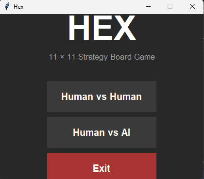
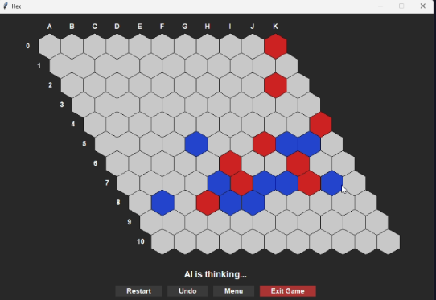
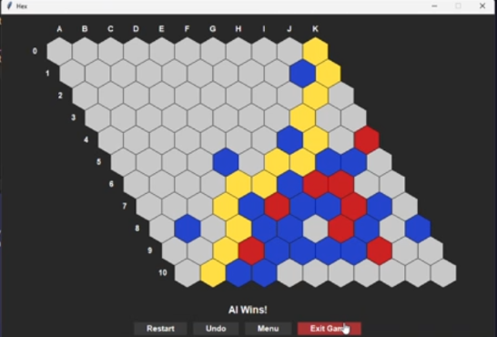

# Hex-AI — 11×11 Hex Board Game with AI

<div align="center">


**A fully graphical implementation of the classic Hex strategy game, featuring a near-unbeatable AI powered by iterative-deepening Alpha-Beta search.**

</div>

---

## Overview

[Hex](https://en.wikipedia.org/wiki/Hex_(board_game)) is a two-player connection strategy game invented independently by Piet Hein and John Nash. Players alternate placing stones on an 11×11 hexagonal grid. The first player to form a continuous chain connecting their two opposite sides wins.

This project delivers:
- A **modern dark-themed GUI** built with Python's tkinter, drawing the board as real canvas hexagons
- A **Human vs Human** mode for two local players
- A **Human vs AI** mode where the AI uses **iterative-deepening Alpha-Beta search** — one of the strongest algorithms possible for Hex
- Sound effects, game controls (Restart / Undo / Menu / Exit), and a live status label

---

## Demo

> **Add a screenshot or GIF here.**  
> See [Images & Video in README](#adding-images--videos-to-readme) for instructions.

```
screenshots/start_screen.png
screenshots/gameplay.png
screenshots/ai_win.png
```

---

## Features

| Feature | Detail |
|---------|--------|
| **Board** | 11×11 hexagonal grid drawn as canvas polygons |
| **Game modes** | Human vs Human · Human vs AI |
| **AI algorithm** | Minimax + Alpha-Beta pruning + iterative deepening |
| **AI heuristics** | TwoDistance (primary) · Charge (move sorter) |
| **AI strength** | Searches depth 4–7+ per move with a 10-second budget |
| **Move ordering** | Killer-move heuristic + transposition table |
| **Controls** | Restart · Undo · Menu · Exit Game |
| **Sound effects** | Human move · AI move · Win (via pygame, optional) |
| **Win detection** | Dijkstra-style path search with winning-path highlight |
| **Threading** | AI runs in a background thread — GUI never freezes |

---

## Project Structure

```
11-size-hex-game/
├── main.py          # Entry point (3 lines — launches GUI directly)
├── GUI.py           # All visuals, game loop, start screen, controls
├── board.py         # HexBoard data structure, win detection, undo
├── player.py        # GuiPlayer + AlphaBetaPlayer (AI)
├── heuristic.py     # TwoDistanceHeuristic, ShortestPathHeuristic, ChargeHeuristic
├── sounds/
│   ├── human_move.ogg
│   ├── AI_move.ogg
│   └── win_sound.ogg
├── requirements.txt
├── .gitignore
├── LICENSE
└── README.md
```

---

## Technologies Used

| Technology | Purpose |
|-----------|---------|
| **Python 3.8+** | Core language |
| **tkinter** | GUI framework (included with Python) |
| **pygame** *(optional)* | Sound effects — game runs fine without it |
| **heapq** | Priority queue for Dijkstra win-detection |
| **threading** | Background AI computation |

---

## Installation

### 1. Prerequisites

- **Python 3.8 or higher** — [Download](https://www.python.org/downloads/)
- tkinter is bundled with Python on Windows and macOS.  
  On Linux: `sudo apt-get install python3-tk`

### 2. Clone the Repository

```bash
git clone https://github.com/mhdnazrul/11-11-Hex-board-game.git
cd 11-11-Hex-board-game
```

### 3. Install Dependencies

```bash
pip install -r requirements.txt
```

> Only `pygame` is listed as an optional dependency.  
> If you skip this step the game still runs — sound is simply disabled.

### 4. Run the Game

```bash
python main.py
```

The GUI window opens **immediately** — no terminal questions.

---

## How to Play

### Start Screen
Select a game mode:
- **Human vs Human** — two players share the keyboard/mouse
- **Human vs AI** — you play Blue, the AI plays Red

### Rules
- **Blue (Player 1)** must connect the **Left edge → Right edge**
- **Red (Player 2)** must connect the **Top edge → Bottom edge**
- Players alternate turns; no captures
- First to complete a continuous chain wins

### Board Coordinates
- Columns: **A – K** (left → right)
- Rows: **0 – 10** (top → bottom)

### Controls

| Button | Action |
|--------|--------|
| Click a hex | Place your stone |
| **Restart** | Reset the board in the same mode |
| **Undo** | Remove the last move (HvAI: undoes both AI + your move) |
| **Menu** | Return to the start screen |
| **Exit Game** | Close the application |

---

## How the AI Works

The AI is implemented as `AlphaBetaPlayer` in `player.py` and uses several techniques to play as strongly as possible:

### 1. Minimax with Alpha-Beta Pruning
The AI builds a game tree and evaluates positions by considering both players' optimal moves. Alpha-beta pruning eliminates branches that cannot possibly affect the final decision, typically cutting the search space to ~√(branching_factor) compared to plain Minimax.

### 2. Iterative Deepening
Instead of searching to a fixed depth, the AI searches depth 1, 2, 3, … and stops when its **10-second time budget** is exhausted. The last fully completed depth is used. This means:
- Early game (many moves): typically reaches depth 4–5
- Late game (fewer moves): often reaches depth 6–7

### 3. TwoDistanceHeuristic (Primary Evaluation)
Evaluates how many "two-distance" steps each player needs to complete their path. Two-distance is harder to confuse than straight shortest-path because it requires two independent bridge carriers to any cell.

### 4. ChargeHeuristic (Move Sorter)
Treats stones like electric charges and identifies "contested" board regions (saddle points in the charge field). Used to order candidate moves before search — better-ordered moves lead to far more alpha-beta cutoffs.

### 5. Killer-Move Heuristic
Remembers which moves caused cut-offs at each depth and tries them first in sibling nodes.

### 6. Transposition Table
Caches previously evaluated board positions so that equivalent states reached via different move orders are not re-evaluated.

### Combined Effect
These techniques together produce an AI that is **extremely difficult for human players to beat**. The AI consistently finds optimal or near-optimal moves and has no random component.

---

## Game Modes

| Mode | Description |
|------|-------------|
| **Human vs Human** | Two players on the same machine, alternating turns |
| **Human vs AI** | You (Blue) vs the Hard AI (Red) — best possible AI config |

---
## Adding Images & Videos

### 📸 Screenshots

<p align="center">
  
  <br><b>Start Screen</b>
</p>

<p align="center">
  
  <br><b>Gameplay</b>
</p>

<p align="center">
  
  <br><b>AI Win Screen</b>
</p>

---

🎥 **Watch the full demo here:**  
👉 <a href="https://jumpshare.com/share/HLZ14adg3JKKZucVDtss" target="_blank">Click to Watch Video</a>
---

## Future Improvements

- [ ] **MCTS with heuristic rollouts** — the current MCTS skeleton uses random playouts; guided rollouts would be much stronger
- [ ] **Opening book** — pre-computed strong first moves for the AI
- [ ] **Winning path animation** — animate the winning chain with a colour fade
- [ ] **Move timer** — show per-move elapsed time
- [ ] **Export/import** — save and load game states
- [ ] **Difficulty selector** — expose depth / time budget in the UI
- [ ] **Board size selector** — allow 7×7, 9x9, and 13×13 in the UI
- [ ] **Automated tests** — unit tests for win detection, undo, and AI correctness

---

## Contributing

Contributions are welcome!

1. Fork the repository
2. Create a feature branch: `git checkout -b feature/my-feature`
3. Commit your changes: `git commit -m "Add my feature"`
4. Push: `git push origin feature/my-feature`
5. Open a Pull Request

Please follow **PEP 8** style guidelines and add comments for clarity.
